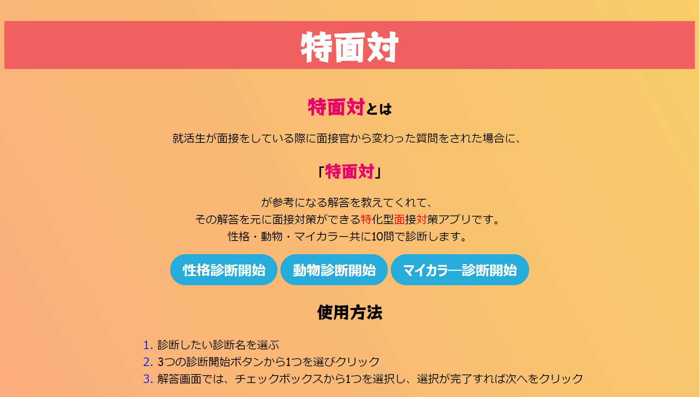

# 特面対
## 神戸電子専門学校 DigitalWorksページ
[![画像][def]][def2]
## 開発環境

  
  
  
  
  
  

## 特面対とは
就活生が面接をしている際に面接官から変わった質問をされた場合に、「__特面対__」が参考になる解答を教えてくれて、
その解答を元に面接対策ができる特化型面接対策アプリです。

## 主な機能
| ホーム画面 | 性格診断 |
| ---- | ---- |
|  |  |
| ホーム画面から各診断モードを選択できます。 機能説明、使用方法も確認できます。 | あなたの性格を診断をして、面接で使えるアピールポイントをアドバイスします。 |

| 動物診断 | マイカラー診断 |
| ---- | ---- |
|  |  |
| あなたに合う動物診断をして、面接で使えるアピールポイントをアドバイスします。 | あなたの色を診断をして、面接で使えるアピールポイントをアドバイスします。 |

## 動作環境
- Windows 10
- ブラウザ(Google Chrome、Microsoft Edge)

## 使い方
1. index.htmlをブラウザで開く。
2. ページ中央から診断したいモードを選択する。
3. 質問に対し回答を選択し、「次へ」を押す。 
(回答を訂正したい場合は「戻る」ボタンを押す)
4. 10問回答することであなたに合った診断結果が出ます。 
診断結果を活用して面接対策をしましょう。

- 画面上部のヘッダーをクリックすることでいつでもホーム画面に戻ることが出来ます。
 

&copy; 2023 J22レモン水

[def]: https://digitalworks-it.com/wp-content/uploads/2024/01/0J01002-%E3%82%A2%E3%82%A4%E3%82%AD%E3%83%A3%E3%83%83%E3%83%81.jpg
[def2]: https://digitalworks-it.com/2024/01/10/%e3%80%90%e7%89%b9%e9%9d%a2%e5%af%be%e3%80%91%e3%83%ac%e3%83%a2%e3%83%b3%e6%b0%b4/
